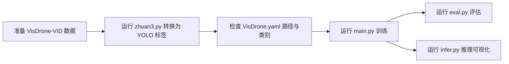

# YOLO + VisDrone 项目使用说明（myReadme）

## 1. 项目简介

本项目基于 `Ultralytics YOLO`，目标是使用 **VisDrone2019-VID** 数据集完成目标检测训练，并支持完整的：

1. 数据转换（VisDrone 原始标注 -> YOLO 标注）
2. 模型训练（train）
3. 模型评估（val）
4. 模型推理（predict）

当前工程中包含了 Ultralytics 源码副本以及你本地的训练/推理脚本，适合在 Windows + Python 环境下直接跑通。

---

## 2. 项目结构（关键部分）

```text
e:\Vscode_code\yolo
├─ yolo26n.pt                      # 预训练权重（初始模型）
├─ infer.py                        # 推理脚本（项目根目录）
├─ eval.py                         # 评估脚本（项目根目录）
├─ runs\detect\...                 # 训练、评估、推理输出（常见输出目录）
└─ ultralytics-main
   ├─ main.py                      # 训练入口脚本
   ├─ zhuan2.py                    # 仅转换 VID-train（数据转换）
   ├─ zhuan3.py                    # 同时转换 VID-train + VID-val（推荐）
   ├─ datasets
   │  ├─ VisDrone.yaml             # 数据集配置
   │  ├─ VisDrone2019-VID-train
   │  │  ├─ sequences              # 原始视频帧
   │  │  ├─ annotations            # 原始标注
   │  │  ├─ images\train           # 转换后训练图像
   │  │  └─ labels\train           # 转换后训练标签（YOLO格式）
   │  └─ VisDrone2019-VID-val
   │     ├─ sequences
   │     ├─ annotations
   │     ├─ images\val
   │     └─ labels\val
   └─ ultralytics\...              # Ultralytics 框架代码
```

---

## 3. 工作流总览



---

## 4. 环境准备

### 4.1 Python 环境建议

- Python: `3.9+`（建议 3.10 或 3.11）
- PyTorch: 与本机 CUDA 匹配版本
- 操作系统：Windows（当前项目路径已是 Windows 绝对路径）

### 4.2 依赖安装（建议）

在 `e:\Vscode_code\yolo\ultralytics-main` 下执行：

```powershell
pip install -e .
pip install opencv-python tqdm
```

如果你使用的是独立虚拟环境（推荐），先激活环境再安装依赖。

---

## 5. 数据准备与转换

### 5.1 原始数据目录要求

以 `VID-train` 为例，转换前应包含：

```text
VisDrone2019-VID-train
├─ sequences
└─ annotations
```

`VID-val` 同理。

### 5.2 运行转换脚本（推荐 `zhuan3.py`）

在 `e:\Vscode_code\yolo\ultralytics-main` 下执行：

```powershell
python .\zhuan3.py
```

脚本行为：

1. 读取每个序列的帧和标注
2. 过滤 `category = 0`（忽略区域）
3. 将框从像素坐标转为 YOLO 归一化格式：`class x_center y_center w h`
4. 输出到：
   - `datasets\VisDrone2019-VID-train\images\train`
   - `datasets\VisDrone2019-VID-train\labels\train`
   - `datasets\VisDrone2019-VID-val\images\val`
   - `datasets\VisDrone2019-VID-val\labels\val`

---

## 6. 数据集配置说明（VisDrone.yaml）

文件位置：`e:\Vscode_code\yolo\ultralytics-main\datasets\VisDrone.yaml`

关键字段：

- `path`: 数据集根目录（当前为绝对路径）
- `train`: 训练图像目录（相对 `path`）
- `val`: 验证图像目录（相对 `path`）
- `names`: 10 个类别定义

类别映射如下：

| id | class |
|---|---|
| 0 | pedestrian |
| 1 | people |
| 2 | bicycle |
| 3 | car |
| 4 | van |
| 5 | truck |
| 6 | tricycle |
| 7 | awning-tricycle |
| 8 | bus |
| 9 | motor |

---

## 7. 训练模型

训练脚本：`e:\Vscode_code\yolo\ultralytics-main\main.py`

当前默认配置：

- 权重：`E:/Vscode_code/yolo/yolo26n.pt`
- 数据：`E:/Vscode_code/yolo/ultralytics-main/datasets/VisDrone.yaml`
- `epochs=10`
- `imgsz=640`
- `batch=6`
- `workers=2`

从项目根目录执行：

```powershell
python .\ultralytics-main\main.py
```

输出通常在：

- `e:\Vscode_code\yolo\runs\detect\train*`

权重文件：

- `best.pt`：验证集表现最优权重
- `last.pt`：最后一个 epoch 权重

---

## 8. 评估模型（验证集）

评估脚本：`e:\Vscode_code\yolo\eval.py`

建议显式传参（更稳妥，避免默认路径偏差）：

```powershell
python .\eval.py `
  --weights .\runs\detect\train5\weights\best.pt `
  --data .\ultralytics-main\datasets\VisDrone.yaml `
  --split val `
  --imgsz 640 `
  --batch 6 `
  --workers 2
```

评估结果会输出到控制台，并写入 `runs\detect\val*`。

常见核心指标：

- `metrics/mAP50(B)`
- `metrics/mAP50-95(B)`
- `metrics/precision(B)`
- `metrics/recall(B)`

---

## 9. 推理模型（可视化检测效果）

推理脚本：`e:\Vscode_code\yolo\infer.py`

推荐示例（对 val 图像目录推理并保存结果）：

```powershell
python .\infer.py `
  --weights .\runs\detect\train5\weights\best.pt `
  --source .\ultralytics-main\datasets\VisDrone2019-VID-val\images\val `
  --imgsz 640 `
  --conf 0.25 `
  --save `
  --save-txt
```

输出通常在：

- `runs\detect\predict*`（带框图像）
- 对应 `labels` 文本（若启用 `--save-txt`）

---

## 10. 一套可复现的最小流程（推荐顺序）

在项目根目录 `e:\Vscode_code\yolo` 执行：

```powershell
# 1) 转换 train + val 标注
python .\ultralytics-main\zhuan3.py

# 2) 训练
python .\ultralytics-main\main.py

# 3) 评估（请替换成你最新的 train 目录）
python .\eval.py --weights .\runs\detect\train5\weights\best.pt --data .\ultralytics-main\datasets\VisDrone.yaml

# 4) 推理可视化
python .\infer.py --weights .\runs\detect\train5\weights\best.pt --source .\ultralytics-main\datasets\VisDrone2019-VID-val\images\val --save --save-txt
```

---

## 11. 常见问题与排查

### 11.1 路径相关报错

现有脚本包含较多绝对路径（`E:/Vscode_code/...`），换电脑/换目录后需要同步修改：

- `ultralytics-main\main.py`
- `ultralytics-main\zhuan2.py`
- `ultralytics-main\zhuan3.py`
- `ultralytics-main\datasets\VisDrone.yaml`

### 11.2 `CUDA out of memory`

优先调整：

1. 降低 `batch`（如从 6 改为 4/2）
2. 减小 `imgsz`（如 640 -> 512）
3. 使用更小模型或开启半精度（按你环境支持情况）

### 11.3 训练无标签或标签数量异常

检查：

1. `labels\train`、`labels\val` 是否已生成
2. 标签文件是否非空
3. `VisDrone.yaml` 的 `path/train/val` 是否匹配真实目录

### 11.4 评估脚本默认 `--data` 找不到

`eval.py` 在项目根目录时，推荐始终显式指定：

- `--data .\ultralytics-main\datasets\VisDrone.yaml`

---

## 12. 可优化方向（下一步）

1. 将所有绝对路径改为相对路径 + `argparse` 参数，提高可移植性。
2. 增加一个 `train_and_eval.py`，自动寻找最新 `best.pt` 并评估。
3. 引入实验记录（如 CSV/TensorBoard）和统一配置文件（YAML），便于对比不同超参数结果。

---

## 13. 许可证说明

`ultralytics-main` 目录沿用上游 Ultralytics 项目的许可证与约束。若用于分发或商用，请先核对对应许可证条款。
